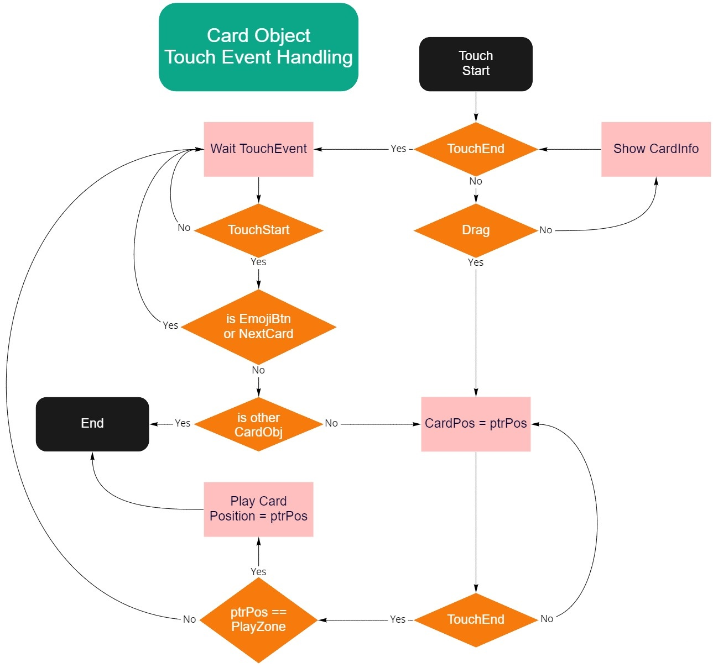

# 전투 시스템

## 전투 진행 과정
1. 전투의 승패는 획득한 크라운의 개수로 결정한다.
    - 두 플레이어는 상대방 타워를 파괴하면 크라운을 얻을 수 있다.
        - img: 크라운을 획득하는 이미지
    - 파괴한 타워 하나당 크라운 한 개를 획득하며, 상대방의 킹타워를 파괴 시 상대방의 남은 타워를 모두 파괴한다.
        - img: 킹타워가 부서지며 남은 타워가 모두 파괴되어 크라운을 획득하는 이미지
    - 3개의 크라운을 획득한 플레이어가 있는 경우 전투 결과화면이 출력되고 전투는 종료된다.

2. 전투 시간에 따라 추가 룰이 적용된다.
    - 전투 시작: 자원에 해당하는 엘릭서의 회복속도 계수는 1이다.
    - 2분 이후: 엘릭서 회복속도 계수는 2가 된다.
    - 3분 이후: 양측 플레이어가 획득한 크라운 개수를 비교한다. 더 많은 사람이 승리한다.
        - 만약 크라운 개수가 동일한 경우 [*서든데스](#각주) 룰을 적용한다.
        
    - 4분 이후: 엘릭서 회복 속도 계수는 3이 된다.
    - 5분: 아직 승부가 나지 않았다면 전투를 중단하고 [*타이브레이커](#각주) 룰을 적용한다.

3. 전투 종료 시 획득한 크라운의 개수를 비교하여 전투 결과를 출력한다.
    - 획득한 크라운의 개수가 동일한 경우 무승부가 된다.

## UI

1. 시작화면
    - 게임 시작시 플레이어의 아레나와 선택한 전투 모드가 나타난다.
    - 이후 두 플레이어에 대한 정보를 보여준다.

2. 게임씬 기본화면
    - 상대방 정보
        - 닉네임, 클랜명, 클랜마크, 트로피 점수
    - 남은시간
        - 남은시간 3분 / 오버타임 2분
    - 엘릭서 계수
        - 2분 이후부터 보인다.
    - 중앙정보 텍스트
    - 스코어
    - 다음 카드 정보
    - 핸드(카드와 엘릭서)

3. 카드

각 처리문을 기준으로 설명을 첨부한다
    1. Show CardInfo가 수행되는 일련과정
    2. 
    3. Play Card: 카드의 소멸까지
<!-- 이벤트      |  조건     |       동작
----------------|------------|------------
`Touch`         ||  오브젝트를 선택한다. 선택된 카드는 시각적으로 강조된다. 다른 카드가 선택된 상태였다면 그 카드의 선택을 취소한다.
|
[*`Hold`](#각주) ||  카드의 능력치를 볼 수 있다. 보여지는 능력치는 카드마다 다르다.
|
`Drag`          |포인터가 핸드 위에 있다|  포인터를 따라 움직인다. 전장에 가까울수록 카드는 작아지고 투명해진다.
|               |포인터가 전장 위에 위치한다|  포인터를 따라 카드의 이름과 레벨이 보여진다. 카드 사용시 전장에 생성될 유닛/건물/마법의 이미지나 효과 적용범위가 보여진다. 전장에 해당 카드를 사용할 수 없는 구역이 표시된다.
|
`TouchEnd`      |선택된 카드가 있고 포인터가 핸드 위에 위치한다.|  카드가 제자리로 돌아간다.
|               |선택된 카드가 있고 포인터가 전장 위에 위치한다.|  포인터 위치에 선택한 카드가 사용된다. 소모된 엘릭서가 나타나고 유닛/건물의 경우 배치시간이 나타난다.
|               |선택된 카드가 없고 포인터가 전장 위에 위치한다.|  선택된 카드가 없다는 경고 메시지가 나타난다.
|| -->

4. 전장
- 전장에 배치된 유닛/건물/마법은 메커니즘에 따라 행동한다.
- 플레이어는 이미 소환된 유닛/건물/마법을 직접 조종할 수 없다.
- 유닛 오브젝트
    - 레벨, 보호막 여부, 체력
- 건물 오브젝트
- 마법 오브젝트

5. 이모티콘 버튼
- 상대방에게 감정표현을 할 수 있다.
- 이모티콘 메뉴 버튼
    |이벤트|조건|동작|
    ---|---|---
    `Touch`||이모티콘 리스트를 펼친다.
- 이모티콘 리스트
    |이벤트|조건|동작|
    ---|---|---
    `Touch`||포인터 위치에 있는 이모티콘을 표시한다. 이모티콘 리스트를 닫는다.
    ||이모티콘이 아닌 다른 영역|

## 각주
- 서든데스: 추가 크라운을 획득한 플레이어가 전투에서 즉시 승리하는 규칙.
- 타이브레이커: 파괴되지 않은 타워들의 남은 체력을 비교하여 가장 체력이 적게 남은 타워를 파괴하는 규칙.
- 아레나: 타게임의 랭크 개념.
- Hold: 포인터를 움직이지 않고 일정시간 동안 터치를 유지하는 것.